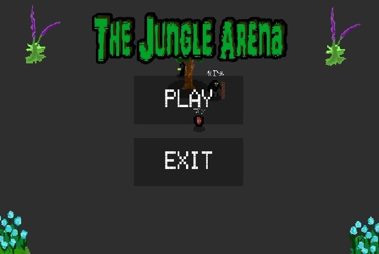

---

- ファンクォックフン
- 連絡先 Email [gochunggiaitri@gmail.com](mailto:a@a.a)
- 専門学校デジタルアーツ東京 ゲームプログラムコース 2026年卒業予定

## スキル
- C#
  - Visual Studioで独自のツールの作成が可能
- Unity
  - オリジナルの個人/チーム作品の開発経験あり
- C/C++
  - コンソールで簡単なデータ処理プログラムを開発

## 取り組んでいるテーマ
1. オリジナルゲーム開発
2. 基本情報処理の内容を活用するゲーム制作事例の調査
3. 基本情報処理に関連する数学やアルゴリズムの仕組みを試せるアプリの開発

## 作品リスト

### Jungle Arena

1v1対戦型ゲーム

開発環境：Unity2021.3.4f1

開発期間：2024/10/18-11/8

全般的なsystemのコードやアセット作成など。